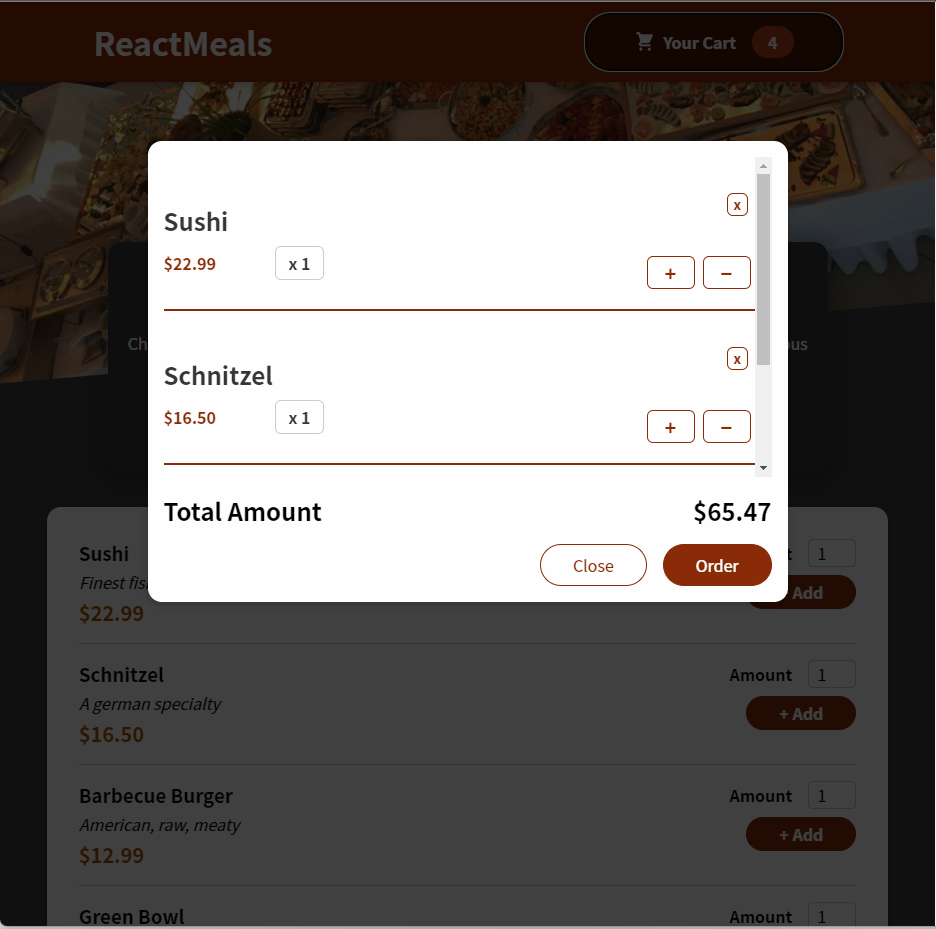

# React meals
Учебный проект

## Технологии

* React
* React context
* Firebase

## Функционал
* добавление/удаление заказов
* сохранение состояния корзины в *local storage*
* получение списка блюд из *Firebase*
* отправка заказов на *Firebase*
* валидация форм

## Скриншот

  

